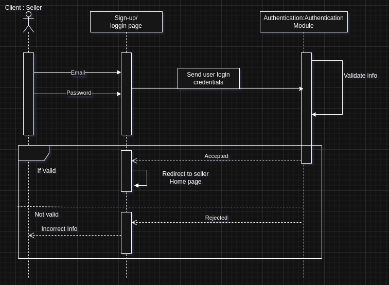
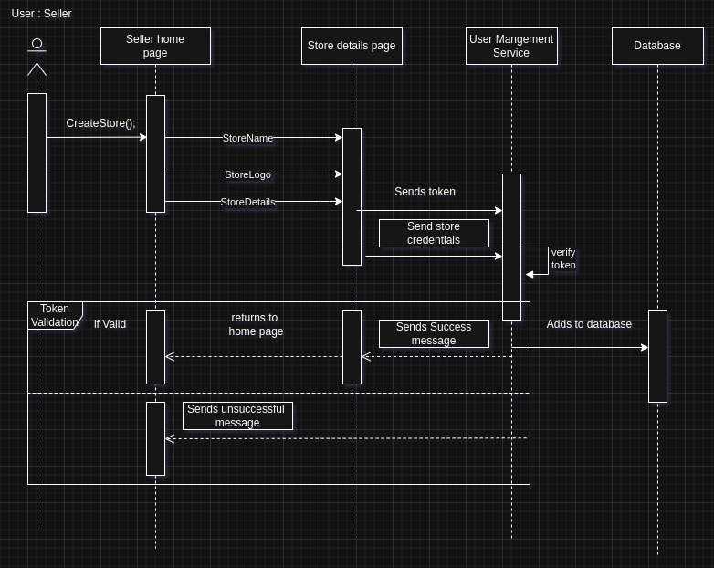
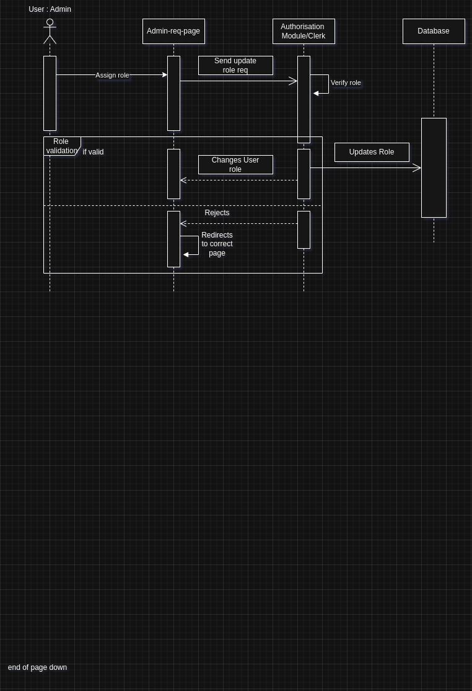

# 🏗 System Architecture

This document outlines the architecture of the *MyStore Web App*, a full-stack application that allows users to browse products, place orders, and manage their account.

---

## 🔧 1. System Overview

The system consists of the following layers:
- **Frontend**: React/TypeScript single-page application (SPA)
- **Backend**: Node.js/Express API
- **Authentication**: Clerk for sign-in/sign-up as well as session management
- **Database**: PostgreSQL via Neon serveless database
- **Deployment**: Both the front-end and Backend are both deployed on Microsoft Azure.

---

## 🧱 2. Class Diagram

The following class diagram represents the key backend services and entities involved in order processing:

### Explanation:
- UserService handles user data and integrates with Clerk
- ProductService retrieves product data from the database
- OrderService handles order creation, updates, and status
- OrderController is the main API interface for order-related requests

---

## 🔄 3. Sequence Diagrams
**These sequence diagram not only highlight sequences in which our software exercutes core functionalities for different user roles assigned in the app but these introduce more granularity in the breaking down of components involved in a session to ensure that all relevant components that exist in the app are exposed.Components are broken down to the least but major role players in the sessions.**

- This diagram explains how the login process works using Clerk authentication for already registered sellers in the platform.

### Steps:
1. The seller submits the login form with the necessary credentials
2. Clerk being our Authentication Module authenticates credentials
3. Clerk returns session token if credentials are valid else a message a reject message is returned to the user.
4. after valid acceptance Frontend stores token
5. Frontend makes authenticated API requests
--- 
- The  below diagram demonstrates how a buyer can also create their own store to a become a seller in the platform.
  

### Steps:
1. The buyer clicks the requests to create a store via a click of a button
2. A store form is returned which takes all the required store details and verifed against the database.
3. Store credentials are then stored up and a success message is returned to the now seller.
4. This seller is re-directed to their new seller dashboard where they can view everything relating to their store.

---
- The below diagram demonstrates how an unauthenticated user can browser and search all stores as well as view products in detail which includes images.
   

### Steps:
1. The home page for an unauthenticated user contains all stores and allows for them to search for stores
2. Upon picking a paticular store the user can then view and search all products of that store.
3. By clicking a particular product in the store users get a more detailed view of the product
4. A product's card component is the returned to the user with details of the product including product images
---
   
- The below diagram highlight events that allow for an admin to escalate priviledges to other users so that they can also become admins and monitor events in the app

### Steps:
1. Admins can navigate to their requests page where all requests to become an admin are submitted as well as managing user roles in the app.
2. By updating the role of the selected user clerk gets an update request in which it will change the role of that particular user.
3. Upon a successful update a success message is sent to the admin and from there a new admin is added.
---

## 🚀 4. Deployment Architecture

Below is the deployment diagram for the production environment:

### Description:
- *Frontend* is deployed on Vercel
- *Backend* is hosted on Railway
- *Database* (PostgreSQL) is managed by Railway
- *Clerk* handles external authentication
- *API requests* flow: Frontend → Backend → DB

---

## 🔁 5. Data Flow

The data in Storify flows through a layered architecture:

1. **User Input**  
   Users interact with the frontend UI to perform actions like signing up, adding stories, or viewing dashboards.

2. **Frontend to Backend**  
   These interactions are captured via form inputs or button clicks and are sent as HTTP requests (typically JSON payloads) to the backend RESTful API.

3. **Backend Processing**  
   The backend receives the request, validates the data, and routes it through relevant services or controllers.

4. **Database Operations**  
   Data is either fetched from or persisted to a relational database depending on the request type (e.g., read/write operations).

5. **Response to Frontend**  
   The processed result is returned to the frontend and rendered dynamically for the user.

This flow ensures that all data is validated, stored, and retrieved in a secure and organized manner.

---

## 🔐 6. Authentication Flow

We use Clerk for all user authentication. The key flow is:
- Sign-up/sign-in handled by Clerk-hosted or custom UI
- Clerk returns a JWT token to the frontend
- Frontend includes token in headers of protected API routes
- Backend verifies token using Clerk SDK

---
## 7. Folder Structure

This section provides a breakdown of the key architecture-related files and diagrams, describing their content and what to expect in them

---

### `class-diagram.pdf`
- **Description**: A UML class diagram showcasing the key entities, their attributes, and the relationships between them (e.g., inheritance, composition).

---

### `api.md`
- **Description**: Documents the available API endpoints, their request/response structures, and any authentication requirements.

---

### `sequencediagrams/`
- **Description**: A folder containing detailed **sequence diagrams** for different sprints.

---

### `development view.pdf`
- **Description**: Describes the software’s modular structure, layers, and component breakdown (e.g., controller, service, repository).

---

### `PhysicalView.jpeg`
- **Description**: Depicts the physical deployment of the system—servers, databases, network configurations, and how components are distributed across nodes.

---

### `db-schema/data-model.pdf`
- **Description**: Presents an ER diagram or relational model for the database schema, including tables, fields, primary/foreign keys, and relationships.

